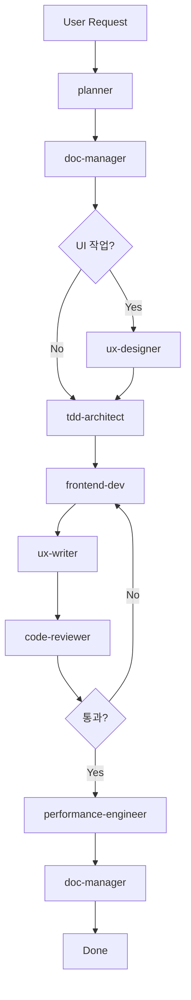

# 🧠 Agent Skills System

> **Philosophy**: "McDonald's System for Code"  
> 이 스킬 시스템은 AI를 '천재 셰프'가 아닌 **'완벽한 매뉴얼을 따르는 프랜차이즈 점장'**으로 만듭니다.

## 📚 Overview

Skills는 프로젝트의 특정 역할(Role)을 수행하는 **실행 가능한 매뉴얼**입니다. 각 스킬은:
- **단일 책임**: 하나의 명확한 역할만 수행
- **SSOT 참조**: 저장소의 가이드 파일만을 진실로 인정
- **Context Diet**: 필요한 파일만 로드하여 환각(Hallucination) 방지
- **구조화된 출력**: 검증 가능한 결과물 생성

## 📖 프로젝트 3대 문서 (The Trinity)

모든 스킬은 다음 3개의 핵심 문서를 **필요할 때** 참조합니다:

| 문서 | 별칭 | 역할 | 답하는 질문 |
|:---|:---|:---|:---|
| **`about_pulse.md`** | 프로젝트 헌법 | 기획/의도 | **왜(Why)** 이 기능을 만드는가? |
| **`design_guide.md`** | 디자인 가이드 | 시각적 기준 | **어떻게 보이는가(How it looks)?** |
| **`PULSE.md`** | 실행 매뉴얼 | 구현 명세 | **어떻게 만드는가(How to build)?** |

### 사용 원칙
- **헷갈릴 때**: `about_pulse.md` (헌법)를 열어 *"왜"*를 상기
- **디자인 결정**: `design_guide.md`의 색상/폰트/레이아웃만 사용 (임의 변경 금지)
- **구현 방법**: `PULSE.md`의 명확한 지시를 따름

## 🎯 Quick Reference

| 스킬 | 트리거 명령어 | 사용 시점 | 참조 파일 |
|:---|:---|:---|:---|
| **planner** | `/plan` | 기능 구현 전 계획 수립 | `about_pulse.md`, `tech.md` |
| **tdd-architect** | `/tdd` | 테스트 주도 개발 시작 | `CODING_CONVENTIONS.md`, `PULSE.md` |
| **code-reviewer** | `/review` | 코드 작성 후 품질 검수 | `CODING_CONVENTIONS.md`, `PULSE.md` |
| **doc-manager** | (자동) | 가이드 수정, CHANGELOG 업데이트 | `antigravity.md`, `CHANGELOG.md` |
| **ux-designer** | `/design` | UI/UX 설계, 접근성 검토 | `design_guide.md`, `about_pulse.md` |
| **frontend-dev** | `/implement` | React 컴포넌트 구현 | `tech.md`, `design_guide.md` |
| **ux-writer** | `/copy` | 마이크로카피, 에러 메시지 작성 | `about_pulse.md`, `design_guide.md` |
| **performance-engineer** | `/optimize` | 성능 최적화, 번들 분석 | `tech.md` |
| **video-creator** | `/video` | VEO3 영상 생성 페이로드 작성 | `Video.md`, `PULSE.md`, `about_pulse.md` |
| **research-assistant** | (자동) | 외부 라이브러리 문서 조회 | `tech.md` + **context7 MCP** |
| **problem-solver** | `/think` | 복잡한 문제 해결 및 분석 | `about_pulse.md`, `tech.md` + **Sequential Thinking MCP** |

## 🔄 표준 워크플로우



## 📖 사용 방법

### 1. 명시적 활성화 (Explicit)
```
User: /act planner
User: 사용자 프로필 기능을 추가하고 싶어요.
```

### 2. 암묵적 활성화 (Implicit)
```
User: 이 디자인의 접근성을 검토해줘.
→ Agent auto-activates: ux-designer
```

### 3. 체인 활성화 (Chained)
```
User: /plan → /act planner
     승인 후 → /tdd → /implement → /review
```

## 🚀 Best Practices

### ✅ DO
- 작업 시작 전 항상 **planner**부터 활성화
- 코드 수정 시 **doc-manager**로 가이드 파일 선행 업데이트
- UI 작업 시 **ux-designer** → **frontend-dev** 순서 준수
- 작업 완료 후 **code-reviewer** 감사 필수

### ❌ DON'T
- 여러 스킬을 동시에 활성화하지 마세요 (단, planner + tdd-architect는 병렬 가능)
- doc-manager 없이 가이드 파일 수정 금지
- code-reviewer를 건너뛰고 배포하지 마세요

## 🛠️ 스킬 상세 설명

### Core Workflow Skills
- **[planner](./planner/SKILL.md)**: Step 2 - Planning & Architecture
- **[code-reviewer](./code-reviewer/SKILL.md)**: Step 4 - QA & Security Check
- **[doc-manager](./doc-manager/SKILL.md)**: Rule 3 - SSOT Updates
- **[tdd-architect](./tdd-architect/SKILL.md)**: Step 3 - TDD & Coverage

### Design & Implementation Skills
- **[ux-designer](./ux-designer/SKILL.md)**: HCI & UI/UX Expert
- **[frontend-dev](./frontend-dev/SKILL.md)**: React & Tailwind Implementation

### Efficiency Multiplier Skills
- **[ux-writer](./ux-writer/SKILL.md)**: Tone & Manner / Microcopy
- **[performance-engineer](./performance-engineer/SKILL.md)**: Optimization & Web Vitals

### MCP Integration Skills
- **[research-assistant](./research-assistant/SKILL.md)**: External Docs Lookup (context7)
- **[problem-solver](./problem-solver/SKILL.md)**: Complex Problem Solving (Sequential Thinking)

### Domain-Specific Skills
- **[video-creator](./video-creator/SKILL.md)**: VEO3 Payload Generation & Validation

## 🔧 Maintenance

### 스킬 업데이트
1. 프로젝트 철학이 변경되면 관련 SKILL.md 업데이트
2. 새로운 가이드 파일 추가 시 `references` 섹션 업데이트
3. 워크플로우 변경 시 README.md 다이어그램 갱신

### 버전 관리
- SKILL.md 파일도 Git으로 버전 관리
- 중요 변경 시 CHANGELOG.md에 기록

---

**⚠️ Critical Reminder**  
스킬은 "AI의 성격"이 아니라 **"작업 절차서"**입니다.  
채팅에서 "알아서 잘해줘"가 아니라, "이 매뉴얼대로 해줘"를 요청하세요.
