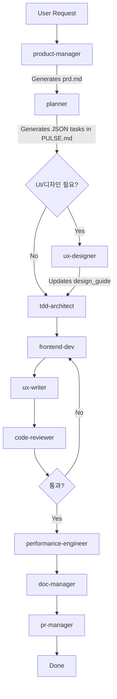

# 🧠 Agent Skills System

> **Philosophy**: "McDonald's System for Code"  
> 이 스킬 시스템은 AI를 '천재 셰프'가 아닌 **'완벽한 매뉴얼을 따르는 프랜차이즈 점장'**으로 만듭니다.

## 📚 Overview

Skills는 프로젝트의 특정 역할(Role)을 수행하는 **실행 가능한 매뉴얼**입니다. 각 스킬은:
- **단일 책임**: 하나의 명확한 역할만 수행
- **SSOT 참조**: 저장소의 가이드 파일만을 진실로 인정
- **Context Hand-over Protocol**: 스킬이 종료될 때마다 후임 스킬을 위해 `.agent/context/active_task.md`를 반드시 남겨 Silo 효과 방지
- **구조화된 출력**: 검증 가능한 결과물 생성

## 📖 프로젝트 4대 문서 (The Core Four)

모든 스킬은 다음 4개의 철저히 분리된 핵심 문서를 참조/수정합니다. 특정 스킬은 특정 문서만 덮어쓸 권리가 있습니다.

| 문서 | 별칭 | 담당 스킬 | 역할 | 답하는 질문 |
|:---|:---|:---|:---|:---|
| **`about_pulse.md`** | 프로젝트 헌법 | `N/A` (고정) | 기획/의도 | **이 프로젝트의 근본 정체성은 무엇인가?** |
| **`prd.md`** | 기획 명세서 | `product-manager` | 비즈니스 로직 및 유저스토리 | **왜(Why) 만들며, 유저는 무엇(What)을 원하는가?** |
| **`PULSE.md`** | 실행/기술 명세 | `planner` | 아키텍처 및 구현 스펙 | **설계된 DB와 컴포넌트를 어떻게(How) 프로그래밍하는가?** |
| **`design_guide.md`** | 디자인 가이드 | `ux-designer` | 시각적 규칙 | **어떤 컴포넌트 라이브러리와 색상을 사용하는가?** |

## 🎯 Quick Reference

| 스킬 | 트리거 명령어 | 사용 시점 | 참조 파일 |
|:---|:---|:---|:---|
| **product-manager** | `/pm` | 기능 개발 최초 진입 단계 (PRD 작성 필요시) | `about_pulse.md` -> `prd.md` 작성 |
| **planner** | `/plan` | 기술 아키텍처 및 태스크 분할 필요시 | `prd.md` -> `PULSE.md` 작성 |
| **tdd-architect** | `/tdd` | 테스트 주도 개발 시작 | `PULSE.md` |
| **code-reviewer** | `/review` | 코드 작성 후 품질 검수 | `PULSE.md` |
| **doc-manager** | (자동) | `CHANGELOG.md` 등 보조 문서 관리 (Core Four 침범 금지) | `CHANGELOG.md` |
| **ux-designer** | `/design` | UI/UX 설계, 접근성 검토 | `prd.md`, `design_guide.md` |
| **frontend-dev** | `/implement` | React 컴포넌트 실제 코딩 | `PULSE.md`, `design_guide.md` |
| **ux-writer** | `/copy` | 마이크로카피, 에러 메시지 작성 | `prd.md`, `design_guide.md` |
| **performance-engineer** | `/optimize` | 성능 최적화, 번들 분석 | `PULSE.md` |
| **pr-manager** | `/pr`, `/commit` | 기능 개발 완료 후 PR/커밋 양식 자동 작성 | `active_task.md`, `git diff` |

## 🔄 표준 워크플로우

```mermaid
graph TD
    A[User Request] --> B[product-manager]
    B -->|Generates prd.md| C[planner]
    C -->|Generates JSON tasks in PULSE.md| D{UI/디자인 필요?}
    D -->|Yes| E[ux-designer]
    D -->|No| F[tdd-architect]
    E -->|Updates design_guide| F
    F --> G[frontend-dev]
    G --> H[ux-writer]
    H --> I[code-reviewer]
    I --> J{통과?}
    J -->|No| G
    J -->|Yes| K[performance-engineer]
    K --> L[doc-manager]
    L --> M[pr-manager]
    M --> N[Done]
```

## 🚀 Fast-Track 워크플로우 (가벼운 수정)

버튼 색상 변경, 오타 수정 등 단순한 작업에도 거창한 PRD와 아키텍처 설계가 필요할까요?
- **`/tweak`** 또는 **`/hotfix`** 트렌지션을 사용하면 `product-manager`와 `planner` 단계를 건너뛰고 곧바로 `frontend-dev` 또는 `code-reviewer`로 진입할 수 있습니다. 
- Fast-Track 작업 시 봇은 SSOT 문서 스왑 단계를 통과하여 시간과 토큰 소모를 극적으로 줄입니다.

## 🤝 Context Hand-Over Protocol

AI는 망각의 동물입니다. 파이프라인의 **다음 스킬로 넘어갈 때 이전 스킬이 얻은 문맥(Context)을 소실하지 않도록**, 모든 스킬은 임무 완료 직전 `.agent/context/active_task.md`를 최신화해야 합니다.

**작성 예시:**
> "저는 product-manager로서 유저 스토리를 짰습니다. 다음 순서인 planner님, 이 사항들을 DB 스키마로 번역해 주세요. 주의점: 기존 유저 세션은 건드리지 마세요."

---

**⚠️ Critical Reminder**  
스킬은 "AI의 성격"이 아니라 **"작업 절차서"**입니다.  
채팅에서 "알아서 잘해줘"가 아니라, "이 매뉴얼대로 해줘"를 요청하세요.
