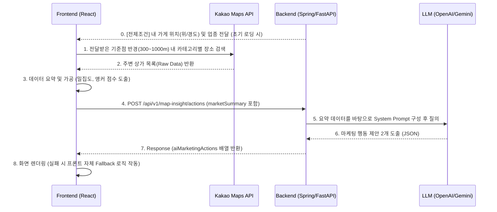

# 상권 분석 AI 마케팅 제안 API 명세 및 통신 아키텍처

> [!NOTE]
> 본 문서는 PULSE 프로젝트의 **프론트엔드-백엔드 간 주변 상권 분석 AI 연동 계약(API Contract)**을 설명합니다. 
> 백엔드 개발자(또는 백엔드 구현을 담당하는 AI)가 이 문서를 읽고 `/api/v1/map-insight/actions` 엔드포인트를 즉각적으로 구현할 수 있도록 작성되었습니다.

## 1. 아키텍처 개요 (옵션 A: 프론트 주도형)

현재 PULSE 프로젝트의 상권 분석은 **"프론트엔드 주도 데이터 수집 ➔ 백엔드 AI 분석"** 구조로 설계되었습니다.

### 🎯 최종 R&R (역할 분담) 요약

**🖥️ 백엔드 (API & AI 담당)**
* **[전송]** 위치값(위도/경도) 및 범용 업종 텍스트(예: "한식", "카페")를 프론트엔드에 전달 (초기 로딩 시)
* **[수신]** 프론트엔드가 계산한 상권 요약 데이터(리포트 결과값) 수신
* **[전송]** 요약 데이터를 기반으로 LLM을 실행하여 도출된 AI 행동 제안을 프론트엔드에 반환

**📱 프론트엔드 (UI & 매핑/계산 담당)**
* **[수신 및 변환]** 백엔드로부터 위치값과 업종을 받아, 카카오맵 전용 코드(FD6, CE7)로 자체 매핑 및 변환
* **[계산 및 출력]** 카카오 API로 주변 상권을 검색하여 밀집도/앵커 점수 등을 계산하고 화면에 리포트 출력
* **[전송]** 계산된 리포트 요약 데이터를 백엔드로 전달
* **[수신 및 출력]** 백엔드로부터 받은 AI 행동 제안을 화면에 출력

> [!IMPORTANT]
> **[전제 조건] 0단계: 내 가게 위치 및 업종 정보 조회 (Back-end ➔ Front-end)**
> 프론트엔드가 상권 분석(카카오맵 검색)을 시작하기 위해서는 **기준점(가게의 위도/경도)과 업종 코드**가 필수적입니다. 
> 따라서 상권 분석 페이지 진입 시점에, 백엔드는 기존 프로필 조회 API(예: `GET /api/v1/users/me` 또는 매장 정보 API)를 통해 **해당 매장의 `latitude`, `longitude`, `category(업종코드)`를 프론트엔드에 기본값으로 제공**해야 합니다.

> [!WARNING]
> **[프론트엔드 연동 주의사항] 더미 위치값(MOCK) 제거 필수**
> 현재 프론트엔드 UI 화면(`CommercialAnalysisPage.jsx`)에는 백엔드가 없는 상태에서 테스트하기 위해 가짜 좌표 데이터(`MOCK_STORE`)가 하드코딩되어 있습니다. 
> **본격적으로 백엔드와 연동 개발을 시작할 때, 프론트엔드의 해당 더미(Mock) 값을 반드시 지우고** 미리 구현된 `fetchMyStoreInfo` API 통신 함수로 교체해야 정상적으로 연동됩니다. (백엔드의 범용 카테고리를 카카오맵 코드로 매핑하는 로직은 이미 해당 함수 안에 구현되어 있습니다.)

1. **데이터 수집 (Front-end):** 프론트엔드가 백엔드로부터 받은 기준 좌표를 바탕으로 카카오맵 Javascript SDK를 이용해 클라이언트 사이드에서 반경 내 상점 목록을 조회하고 요약 데이터(경쟁 심화도, 앵커 상권 점수 등)를 직접 계산합니다.
2. **분석 요청 (Front-end ➔ Back-end):** 프론트엔드는 계산이 완료된 `marketSummary` (요약본) 데이터를 백엔드에 POST로 전송합니다.
3. **AI 처리 (Back-end ➔ LLM):** 백엔드는 전달받은 요약 데이터를 기반으로 프롬프트를 조립하여 LLM(OpenAI/Gemini 등)에 전송, 마케팅 액션 결과를 도출합니다.
4. **결과 반환 (Back-end ➔ Front-end):** 백엔드는 도출된 AI 제안 목록만 프론트엔드로 반환합니다.

### 🔄 시퀀스 다이어그램



---

## 2. API Contract (명세서)

### 2.1 Endpoint
*   **Path:** `POST /api/v1/map-insight/actions`
*   **Content-Type:** `application/json`

### 2.2 Request Payload (프론트 ➔ 백)
프론트엔드는 아래와 같은 구조로 데이터를 던집니다. 백엔드는 이 데이터를 그대로 파싱하여 프롬프트의 재료로 사용하면 됩니다.

```json
{
  "latitude": 37.4979,
  "longitude": 127.0276,
  "radius": 500,
  "category": "FD6",
  "marketSummary": {
    "competitionTotal": 30,    
    "densityPerKm2": 150.5,    
    "anchorScore": 5,          
    "anchorType": "역세권형"   
  }
}
```

*파라미터 설명:*
*   `marketSummary.competitionTotal`: 중심 좌표 반경 내의 **동종 업계 점포 수** (경쟁 강도 판단 지표)
*   `marketSummary.densityPerKm2`: 평방킬로미터(km²) 당 **동종 업계 점포 밀집도**
*   `marketSummary.anchorScore`: 주요 앵커 시설(지하철, 학교, 병원 등)의 **가중치 합산 점수**
*   `marketSummary.anchorType`: 가중치에 따라 프론트가 1차 판별한 **상권의 주요 특징** (예: 역세권형, 학원가형, 의료상권형, 복합상권형, 일반상권형)

### 2.3 Response Payload (백 ➔ 프론트)
백엔드(LLM)는 반드시 아래 형식의 JSON(마케팅 액션 최소 2개)을 반환해야 합니다.

```json
{
  "status": "SUCCESS",
  "data": {
    "aiMarketingActions": [
      {
        "title": "동종 경쟁 심화 분석",
        "why": "사장님, 반경 내 동종 업소가 30개로 꽤 많습니다. 우리 가게만의 독보적인 강점을 어필해야 합니다.",
        "todo": [
          "우리 가게 핵심 장점(USP) 1줄로 정리하기",
          "배달앱 대표 메뉴 사진 먹음직스럽게 교체하기"
        ],
        "cta": { 
          "label": "USP 문구 생성하기", 
          "action": "OPEN_COPY_GENERATOR", 
          "payload": { "type": "usp" } 
        }
      },
      {
        "title": "대중교통 유입 타겟팅",
        "why": "역세권 상권이라 퇴근길 대중교통 이용객 유입이 크게 기대됩니다.",
        "todo": [
          "퇴근길 직장인이 훅 끌릴만한 타임세일 알림 전송",
          "역에서 집으로 가는 동선에 포장 할인 혜택 노출하기"
        ],
        "cta": { 
          "label": "타임세일 쿠폰 만들기", 
          "action": "OPEN_CONTENT_BUILDER", 
          "payload": { "theme": "commute" } 
        }
      }
    ]
  }
}
```

> [!IMPORTANT]
> **프론트엔드 Fallback 안전장치**
> 백엔드 API가 `500 Server Error`를 내거나 아직 열려있지 않은 경우, 프론트엔드에 심어둔 Fallback 로직이 `marketSummary`를 스스로 읽고 임시(더미) 데이터를 화면에 띄웁니다. 따라서 **백엔드는 개발 중 화면 깨짐 걱정 없이 API 내부 로직 고도화에만 집중**할 수 있습니다.

---

## 3. 백엔드(AI) 프롬프트 엔지니어링 가이드

백엔드가 LLM에 질의할 때 사용할 System Prompt 예시입니다. 프론트엔드가 넘겨준 `marketSummary`를 변수로 매핑하여 주입하세요.

```text
너는 외식업 소상공인을 위한 전문 AI 마케팅 컨설턴트야.
아래 주어진 상권 분석 요약 데이터를 바탕으로 사장님이 즉시 실행할 수 있는 '행동 제안(Marketing Actions)' 2가지를 JSON 형태로 반환해줘.

[상권 데이터 요약]
- 주변 경쟁 점포 수: {competitionTotal}개
- 밀집도: 1km² 당 {densityPerKm2}개
- 앵커 시설 점수: {anchorScore}점
- 상권 핵심 특성: {anchorType}

[작성 조건]
1. 경쟁 점포 수가 30개 이상이면 방어적/차별화 마케팅(USP 강조)을 제안할 것.
2. 상권 핵심 특성(예: 역세권형, 학원가형)에 맞는 타겟 고객층(직장인, 학생 등)을 공략하는 마케팅을 제안할 것.
3. 사장님이 친근하게 느낄 수 있는 다정하고 전문적인 한국어 존댓말을 사용할 것.
4. 응답은 반드시 `aiMarketingActions` 배열을 가진 JSON 형식이어야 함.
```
